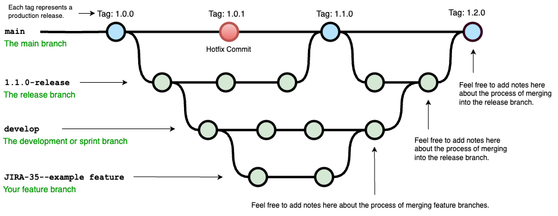

<!-- size: 16:9 -->
<!-- theme: default -->

<!-- paginate: skip -->

<!-- headingDivider: 0 -->

# BRANCHING PATTERNS

---

- SCV: Source Code Versioning

  - Sirven para rastrear cambios y recrear versiones anteriores
  - Para gestionar y coordinar el código fuente en equipos de desarrollo de software
  - Permiten el seguimiento de varias líneas de trabajo y ayudar a los desarrolladores a fusionar líneas

- Workflow y branching patterns

  - Patrones para ayudar a manejar la división del desarrollo en líneas de trabajo que se dividen y fusionan (split/merge) en ramas (branch)
  - Dependen de la estructura social del equipo y otras prácticas

<!--

El código fuente es un activo vital para cualquier equipo de desarrollo de software. Las herramientas de gestión de código fuente sirven para rastrear cambios, lo que facilita la recreación de versiones anteriores del software y ver cómo se desarrolla con el tiempo.

También sirven para coordinar a un equipo de programadores que trabajan en un código base común. Al registrar los cambios que cada desarrollador realiza, estos sistemas pueden hacer un seguimiento de múltiples líneas de trabajo al mismo tiempo y ayudar a los desarrolladores a fusionar estas líneas de trabajo.

Se han desarrollado varios patrones para ayudar a manejar la división del desarrollo en líneas de trabajo que se dividen y fusionan en el flujo de trabajo (workflow) de los equipos de desarrollo de software.

Estos patrones no son estándares definitivos. El flujo de trabajo del desarrollo de software depende en gran medida del contexto, especialmente de la estructura social del equipo y otras prácticas que el equipo siga.

-->

---

## Source branching

Crear una copia para registrar todos los cambios en el código fuente

What is a commit
What is the head
What is a branch
What is a fork

### Branch

= Secuencia de commmits

- Branch head: último commit
- Ramificar para dividir una rama en dos
- Merge: los commits de una rama se aplican a otra

Pero hay otros significados de qué es una rama: confusión terminológica

- Cuando se clona un repo
- En distintos DVCS: mercurial branch $\neq$ git branch $\approx$ mercurial bookmark

### Codeline

= Secuencia particular de versiones de una base de código (_codebase_)

- Cada desarrollador tiene al menos, en cuanto hace cambios locales, una codeline personal en la _working copy_ de su equipo local
- Si se clona un repo git, se hace un checkout de main y se actualiza algo, se tiene una codeline nueva aunque no se hagan commits

<!--

With distributed version control systems like git, we also get additional branches whenever we further clone a repository.

-->

### Mainline

Una rama única compartida por todos los desarrolladores que sirve como estado actual del producto

### Healthy branch

En cada commit, pasar chequeos (pruebas) automáticos para asegurar que la rama no tiene defectos

---

## Flujos de trabajo

- [GitHub flow](https://docs.github.com/es/get-started/quickstart/github-flow): para todo (no sólo desarrolladores)
- Git-flow: para desarrolladores (especialmente para la web)
- [OneFlow](https://www.endoflineblog.com/oneflow-a-git-branching-model-and-workflow): Git-flow considered harmful
- [Patrones originales de git branching](https://nvie.com/posts/a-successful-git-branching-model/)

---

## Patrones de integración

### Mainline integration

### Feature branching

### Frecuencia de integración

### Integración continua

### Feature branching vs Integración continua

### Feature branching en Open Source

### Pre-integration review

### Fricción de integración

### Modularidad

---

## De la línea principal a la entrega del producto

### Release branch

### Maturity branch

### Environment branch

### Hotfix branch

### Release train

### Release-ready mainline

---

## Otros patrones de branching

## Políticas de branching

### Git-flow

### GitHub Flow

### Trunk-Based Development (TBD)

---

## Git: ¿descentralizado o no?

---

## Git: ¿descentralizado o no?

- Origin
- Clone
- Fork

---

### Un modelo de git branching

https://nvie.com/posts/a-successful-git-branching-model/

- Ramas principales: main, develop
- Ramas de apoyo: feature, release, hotfix

---

### Un modelo de git branching

(poner en horizontal)

---

### Branching en Git-flow

